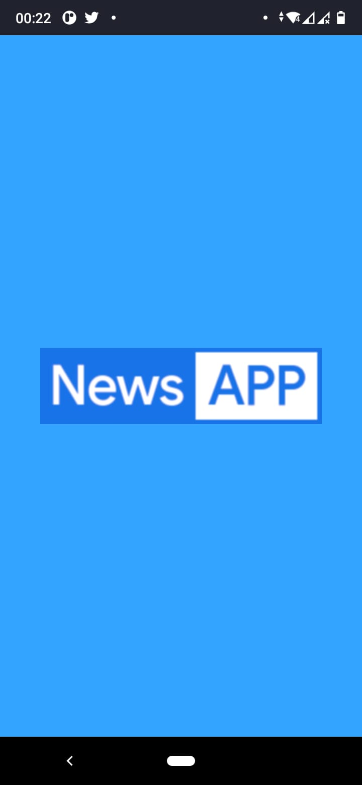
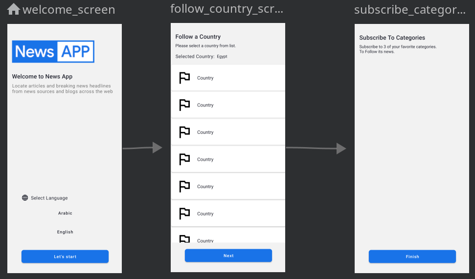
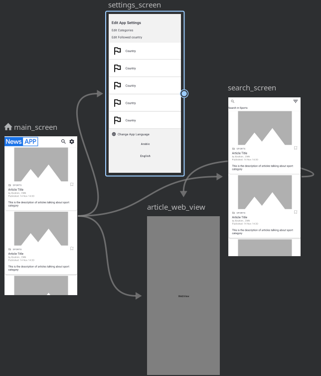

# News App
Locate articles and breaking news headlines from news sources and blogs across the web.

#### This app is a task for [ITWorx](https://itworx.education/).

 Please Note that you have to put your ApiKey in file /res/values/api_key.xml

 You Can generate your api key here [News API](https://newsapi.org/)

### Features

 * Navigation Component
 * Datastore
 * Room Database
 * Retrofit
 * Hilt Dependency Injection
 * MVVM Architecture

### Main Screen

In the beginning check if it's the first time user opens the app, navigate on boarding screens, if everything is set navigate to home screen.

since we're on free subscription, and it update articles every 1 hour and we've a limit of requests.

we'll update articles every 1 hour.

## On boarding Screens

## Home Screens

